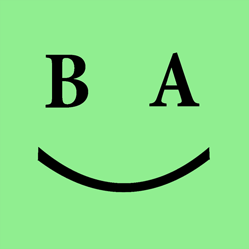

# 
Brain Assistant App

  

  
  (Description Under Development)
  

#### <i>This is a lean personal task manager, originally built to support my [YouTube channel](https://www.youtube.com/@kirillushakov-webmobiledev6785) with a real-world codebase. Over time, it has evolved into my personal playground for experimenting with new technologies, APIs, and development approaches.</i>

## Main Tech View

#### This is [Mobile-First](#mobile-first-aspects) PWA

#### Mobile-First Aspects

**_CSS Layout & Breakpoints_**

- Default styles optimized for small viewports.
- Larger layouts enabled via media queries (min-width).
- [SCSS breakpoints map and media-query mixins](./frontend/src/scss/_breakpoints.scss)

**_Responsive Components_**

- Angular components use flexible containers (`flex`, `grid`) instead of fixed widths. [Example of component styles](./frontend/src/app/mobile-app/components/common/task-tiles-panel/task-tiles-panel.component.scss).
- Images and icons scale with `max-width: 100%` and `height: auto` to prevents overflow and keeps aspect ratio intact on narrow screens. [Main SCSS File](./frontend/src/styles.scss).
- All font sizes, paddings, and margins use `rem` units.
- The root font-size (`html { font-size: ... }`) changes with breakpoints, allowing proportional scaling. [Typography Styles](./frontend/src/scss/_typography.scss).

**_Performance Optimizations for Mobile_**

- Lazy loading of images & modules.
- PWA caching configured via [ngsw-config.json](./frontend/ngsw-config.json) for offline support and faster load times
