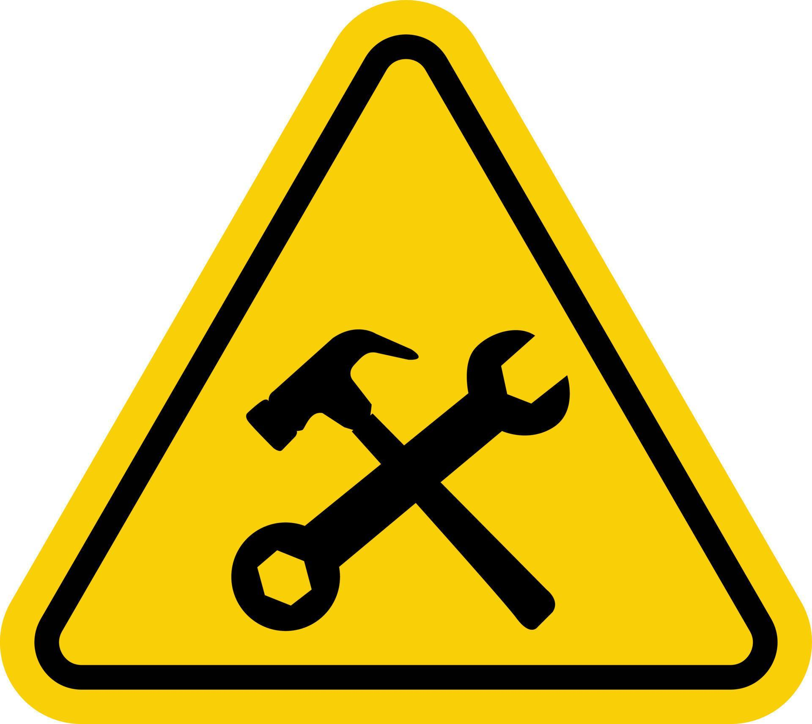

# 
Brain Assistant App

  

  
  (Description Under Development)
  

#### <i>Originally created to support my [YouTube channel](https://www.youtube.com/@kirillushakov-webmobiledev6785) with a real codebase, this project has evolved into a playground for exploring different approaches, APIs, and technologies.</i>

## Main Tech View

#### This is [Mobile-First](#mobile-first-aspects) PWA

#### Mobile-First Aspects

**_CSS Layout & Breakpoints_**

- Default styles optimized for small viewports.
- Larger layouts enabled via media queries (min-width).
- [View styles code](./frontend/src/scss/_breakpoints.scss)
